# 📱 Pokédex hecha en Flutter


Una **Pokédex hecha en Flutter** que consume datos de **PokeAPI**, permite **registro/login con Firebase**, y guarda tus **Pokémon favoritos** en la nube.  
Incluye **modo oscuro** y es un proyecto **Open Source**.

---

## 📌 Contenido
- [✨ Características](#-características)
- [🧰 Tecnologías](#-tecnologías)
- [📸 Capturas](#-capturas)
- [✅ Requisitos](#-requisitos)
- [🚀 Instalación y ejecución](#-instalación-y-ejecución)
- [🔥 Configuración de Firebase](#-configuración-de-firebase)
- [📁 Estructura del proyecto](#-estructura-del-proyecto)
- [🗺️ Roadmap](#️-roadmap)
- [🤝 Contribuir](#-contribuir)
- [📄 Licencia](#-licencia)
- [🧾 Créditos](#-créditos)

---

## ✨ Características

- ✅ Registro e inicio de sesión con **correo + contraseña**
- ✅ Backend con **Firebase** (Auth + base de datos para favoritos)
- ✅ Datos de Pokémon obtenidos desde **PokeAPI**
- ✅ Vista detallada del Pokémon (stats, tipos, etc.)
- ✅ Sistema de **favoritos por usuario**
- ✅ **Modo oscuro / claro**
- ✅ Proyecto **Open Source**

---

## 🧰 Tecnologías

- **Flutter / Dart**
- **Firebase Authentication**
- **Cloud Firestore** (o Realtime Database según implementación)
- **PokeAPI** (fuente de datos)

---

## 📸 Capturas

| Pantalla | Claro | Modo oscuro |
|---------|-------|-------------|
| Home | 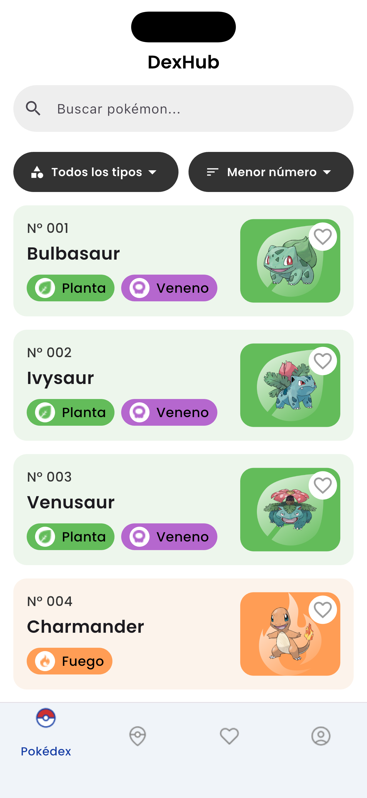 | 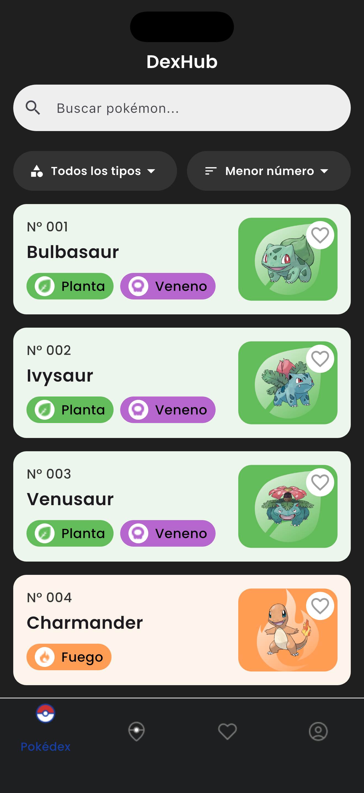 |
| Detalles | 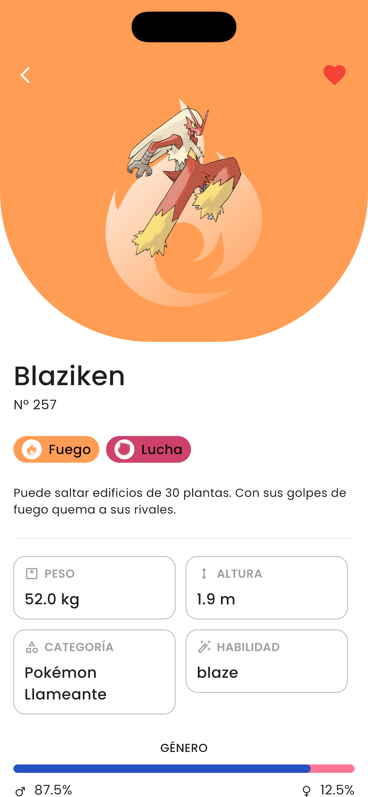 | 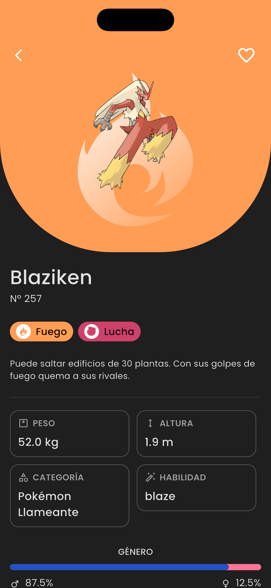 |
| Detalles 2 | 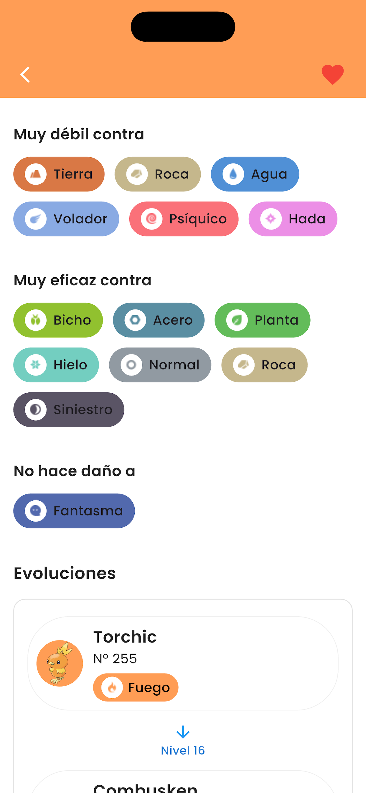 | 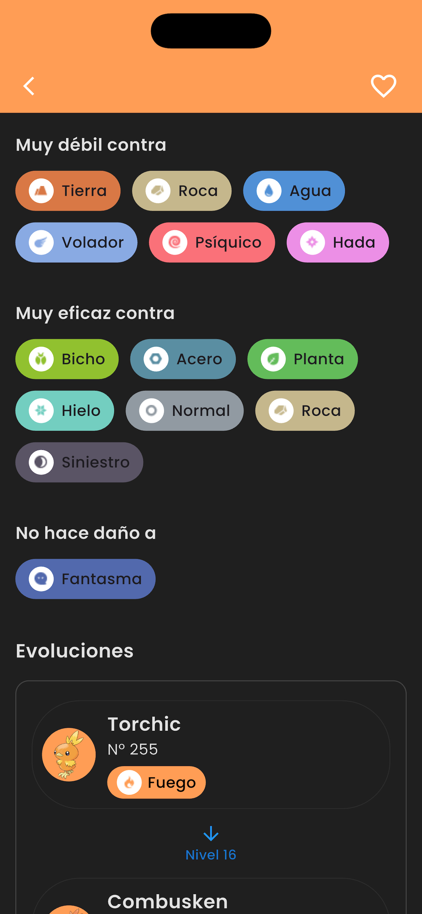 |
| Detalles 3 | 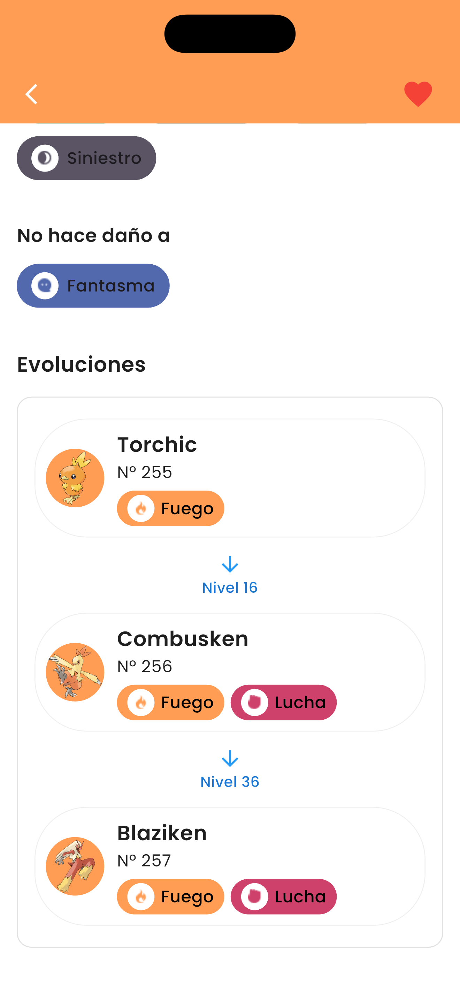 | 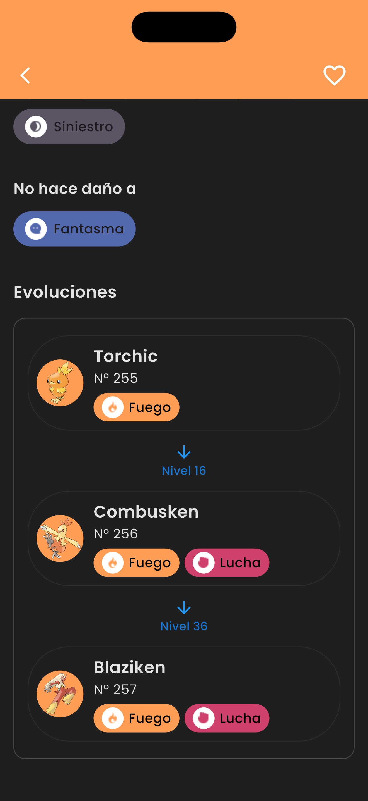 |
| Regiones | 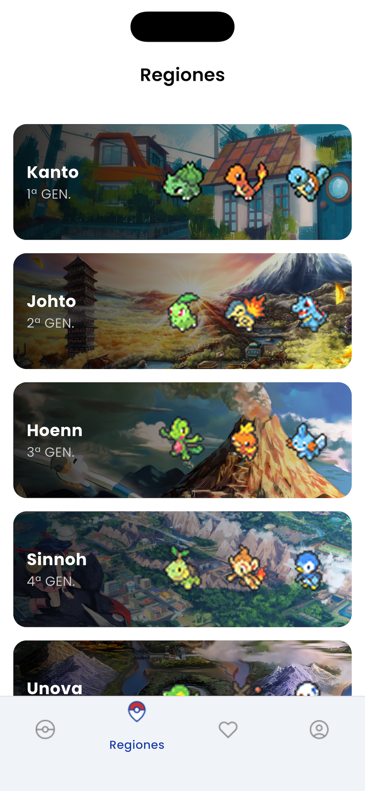 | 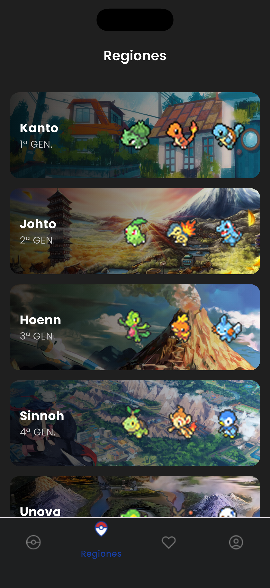 |
| Favoritos | 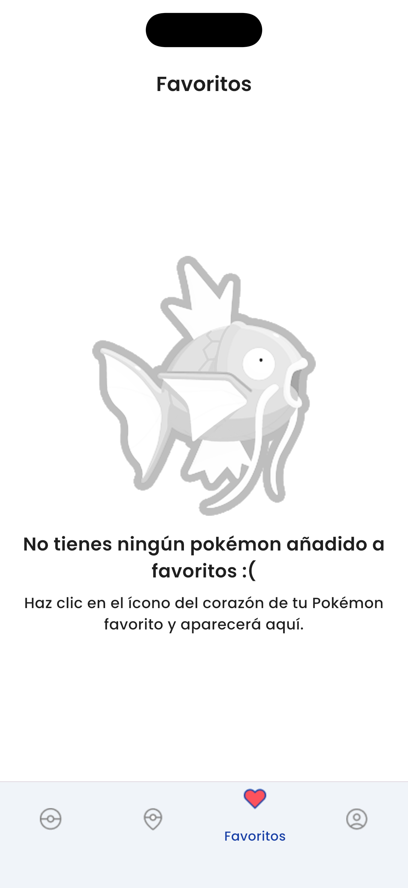 | 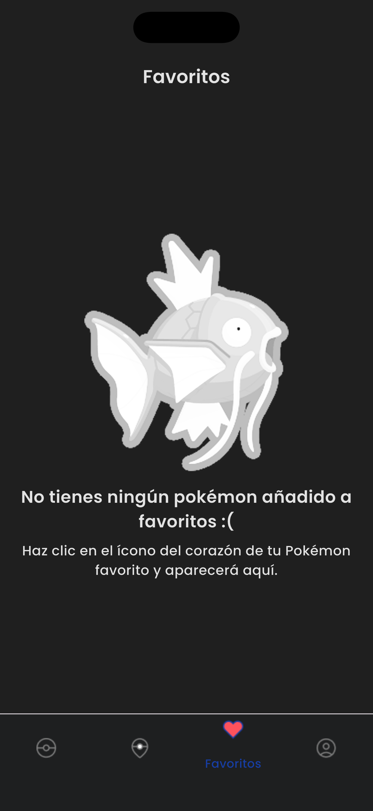 |
| Cuenta | 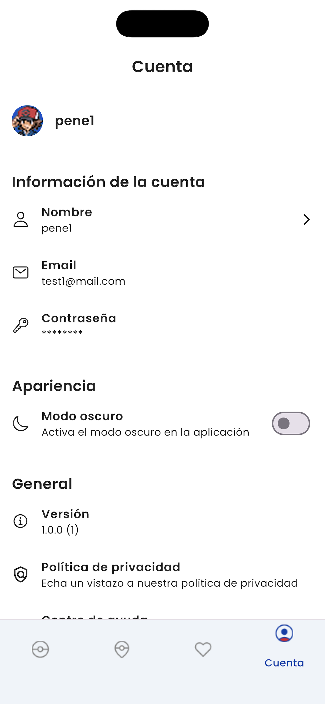 | 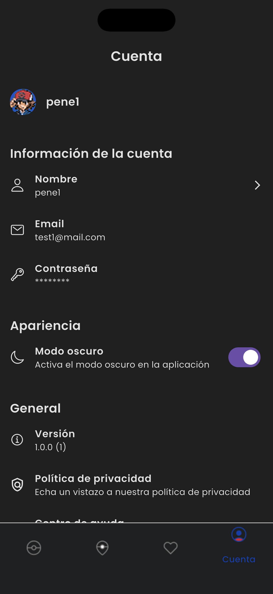 |
| Cuenta 2 | 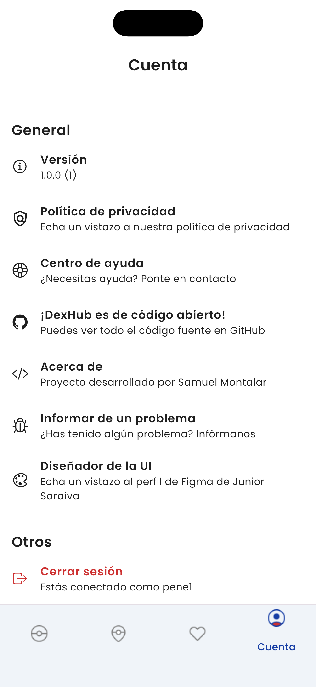 | 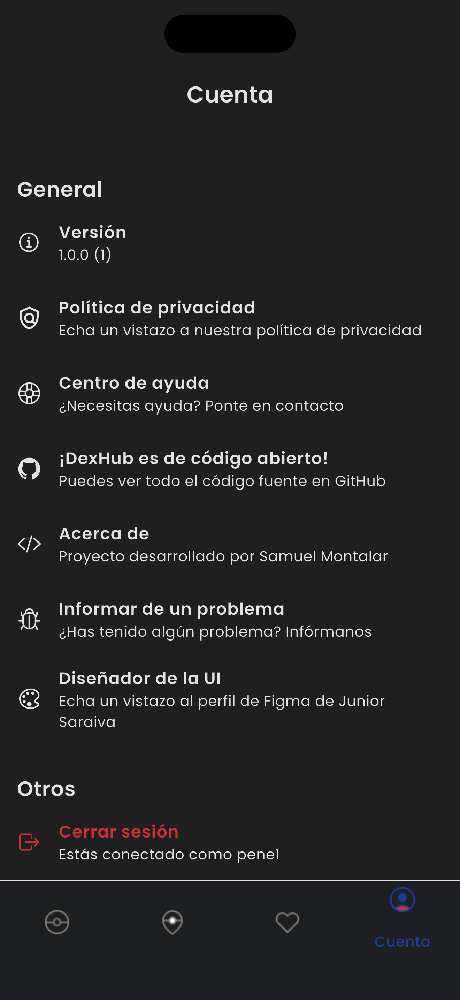 |

---

## ✅ Requisitos

- Flutter SDK instalado
- Dart instalado
- Android Studio / VSCode
- Emulador o dispositivo físico
- Cuenta Firebase (para Auth + DB)

---

## 🚀 Instalación y ejecución

### 1) Clonar el repositorio
```bash
git clone https://github.com/samudev4/DexHub.git
cd DexHub
```

### 2) Instalar dependencias
```bash
flutter pub get
```

### 3) Ejecutar
```bash
flutter run
```

---

## 🔥 Configuración de Firebase

### ⚠️ Este repo NO incluye los archivos de configuración de Firebase por seguridad:

> - android/app/google-services.json
> - ios/Runner/GoogleService-Info.plist

### Opción recomendada: FlutterFire CLI

### 1) Instalar
```bash
dart pub global activate flutterfire_cli
```
### 2) Login
```bash
firebase login
```

### 3) Configurar
```bash
flutterfire configure
```